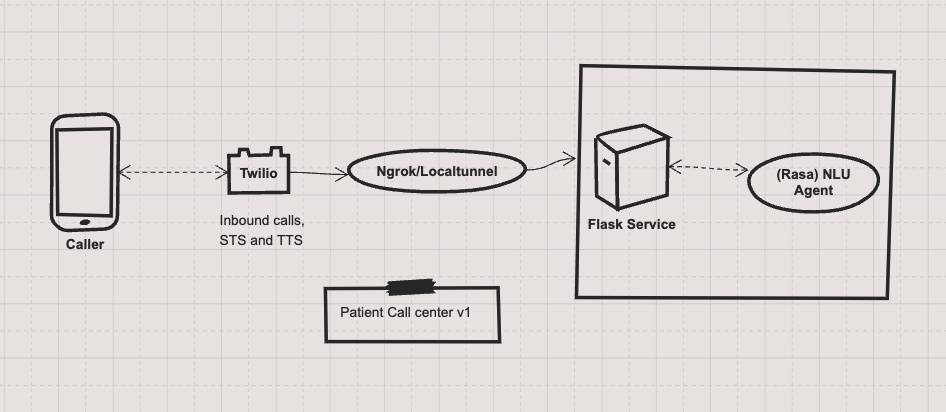
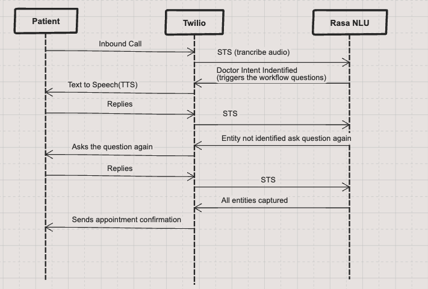

## NLU engine
Basic information captured by (Rasa) NLU engine are
- Name
- DOB
- Reason for calling/ (medical complaint)
- contact number

Rasa NlU is trained on the above entities and will extract entities from text. Using Rasa Forms to capture the all the information to fill all the required slots of informations. The worflow is triggered once doctor appointment booking intent is identified

## setup
Host the trained NLU engine on localhost localhost:5055. Navigate to rasa repository to start the engine and accept the API request

```
nlu_engine % rasa run -m models --enable-api --endpoints endpoints.yml --cors "*"
```

Start the flask app on 

```
export TWILIO_ACCOUNT_SID=***
export TWILIO_AUTH_TOKEN=**
python run.py
```

Route the external traffic using ngrok or localtunnel. 
```
lt --port 5000
```

Create a twilio free trial account with a mobile numnber that will take the inboud call. You need to register the recipient mobile number to recieve the traffic.


## Design


Twilio is handling inbound calls and also being used for TTS and STS feature.

## Workflow



Basic information captured are
- Name
- DOB
- Reason for calling/ (medical complaint)
- contact number

Rasa NlU is trained on the above entities and will capture once 


## improvement areas
- better ASR engine to transcribe text. [Twilio Gather](https://www.twilio.com/docs/voice/twiml/gather) but it is not great with long streaming text. We could replace with deepgram, amazon transcribe or other ASR services.

- Cpture more entitie. It can be extended to capture more information from patient.

- more data to train the model. Better and more on the field data will make the engine perform even more better